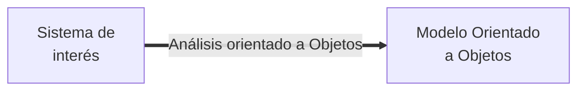

# Clases y objetos

Las **clases** definen las características de las entidades de un sistema de interés. Por otra parte, los **objetos** es una instancia de una clase. Es decir, es una entidad concreta. Un objeto existe en el ámbito de la ejecución de un programa, ya que ocupa memoria y puede utilizar los recursos del sistema computacional donde se ejecuta.

El modelado orientado a objeto involucra identificar los componentes importantes de un sistema de interes y usar clases para estructurar la manera cómo esos componentes son reflejados en un sistema de software. Durante la fase de diseño se refinan las clases del modelo. Pueden descartar clases necesarias o agregar clases que no encontraron en el problema, pero que son útiles para el modelo. También pueden descartar, agregar o actualizar operaciones y características que cada componente del sistema.

&nbsp;

# Abstracción

El objetivo de la abstracción es modelar los componentes del sistema de interés, definiciendo **qué** es lo que hacen, **cómo** se utilizan, **cuáles** son sus características principales y **cómo** intereactúan entre ellos. 

Lo anterior implica que la **abstracción** es un proceso que:

* Extrae las características esenciales de un componente, ignorando los detalles que no aportan.
* Oculta los detalles de implementación de los datos que maneja la clase.
* Proporciona una interfaz clara y definida para interacturar con los datos que maneja la clase

## Ejemplo

El problema de modelamiento consiste en modelar un punto en $R^2$
